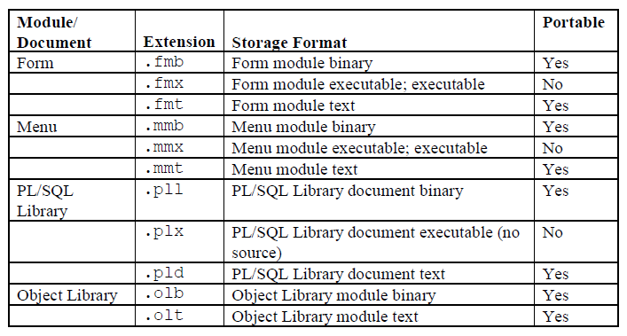

# Compiling a Forms Module

Before you can run a form, you must compile an executable (```*.fmx```) file from the design (```*.fmb```) file that you created in the Forms Builder. Compiling a form (or menu) module creates the needed executable file.

## Module Types and Storage Formats

When you create form modules, menu modules, and library documents in the Forms Builder, they are stored in source files (```*.fmb```, ```*.mmb```, and ```*.pll```) that have a binary format and are portable across platforms. 

The executable application files (```*.fmx```, ```*.mmx```, and ```*.plx```) are also in a binary format; however, **they are not portable** across platforms.

**NOTE:** ```*.pll``` is portable but requires recompilation because it contains both source and compiled code.

