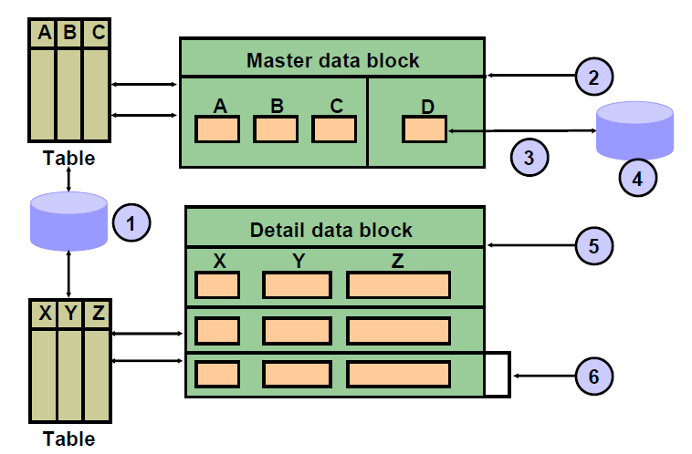

# Forms Module Types

A Forms application consists or many modules (or files).

A module is a major component of your application and is the basis for storage and ownership. A module owns the objects that it contains.

A Forms module can be of the following types:
- **Form**
    - it is the main component of an application
    - it presents the objects and data that users can see or interact with
- **Menu**
    - it consists of a hierarchy of menus, each with selectable items
    - a default menu with all basic operations is provided for every form 
    - it can be used with multiple forms
- **PL/SQL Library**
    - it is a collection of PL/SQL program units whose code can be referenced and called from other modules
- **Object Library**
    - it is a collection of form objects that you can use in other
modules

A form module can be run independently, but menu modules, PL/SQL libraries, and object libraries are functional only when attached to or included in a form module.

## Form Module Objects

Forms modules make up the main body of an Oracle Forms application. 

The 3 major objects in a form module are:
- **Items**
    - interface objects that present data values to the user or enable the user to interact with the form
    - they are logically grouped into blocks and visibly arranged on canvases
- **Blocks**
    - they provide a mechanism for grouping related items into a functional unit for storing, displaying, and manipulating records
- **Canvases**
    - a canvas is a *surface* where visual objects are arranged
    - a canvas can display items from one or more blocks
    - a form module can have several canvases
    - a canvas must be inside a window

When you run a form, you principally navigate by way of items and blocks, not by canvases. Each item has a sequenced position within its block, and each block has a sequenced position in the form.

## Types of Blocks

There are 2 main types of blocks: 
- **data blocks**
    - a data block is associated with a specific database table (or view), a stored procedure, a ```FROM``` clause query, or transactional triggers
    - by default, the association between a data block and the database enables the user to **automatically access and manipulate data in the database**
    - to access data from other tables (nonbase tables), you need to write triggers
- **control blocks**
    - a control block is not associated with a database, and its items do not relate to any columns within any database table
    - control block items are called **control items**

## Data Block Key-Concepts

1. base table source
2. single-record data block
3. trigger access
4. nonbase table source
5. multirecord data block
6. record

