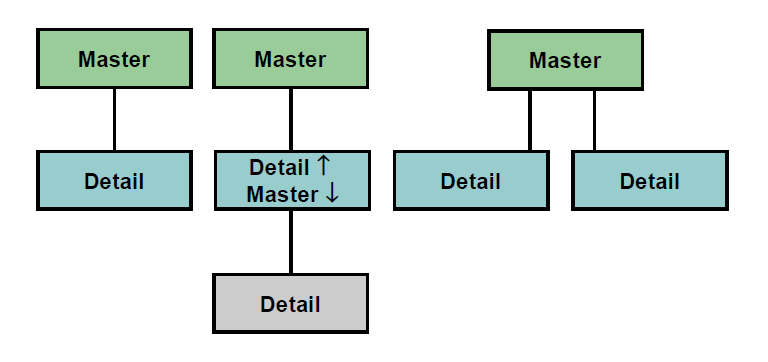

# Master-Detail Forms Module

A form module can contain one or more data blocks. 

Each data block can stand alone or be related to another data block. For example:
- a master block with one detail block
- a master block with one detail block that is the master for another detail block
- a master block with two detail blocks

You can build a master-detail form module either by:
- (explicitly) creating a relation between a master and detail block
- (implicitly) using the Data Block Wizard



## Master-Detail Relation

After you create a master-detail form module, the Data Block Wizard automatically creates a form object that handles the relationship between two associated data blocks. This object is called a **relation**. 

The following tasks occur automatically:
- the new relation object is created under the master data block node in the Object Navigator with default properties
- the relation is given the following default name:
```<MasterDataBlock>_<DetailDataBlock>```
- triggers and program units are generated to maintain coordination between the two data blocks

