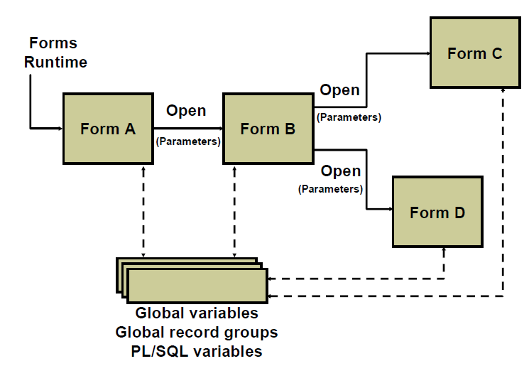

# Multiple Forms Applications

Oracle Forms applications rarely consist of a single form document.

You can design forms to appear in separate windows, so the user can work with several forms concurrently in a session (when forms are invoked by the ```OPEN_FORM``` built-in). Users can then navigate between visible blocks of different forms, much as they can in a single form.

Each form runs within the same Forms Runtime session, and Forms remembers the form that invoked each additional form. This chain of control is used when you exit a form or commit transactions.

There are several methods to exchange data between forms, and code can also be shared. The following objects are available to provide information to all open forms: 
- Global variables
- Global record groups
- PL/SQL variables

