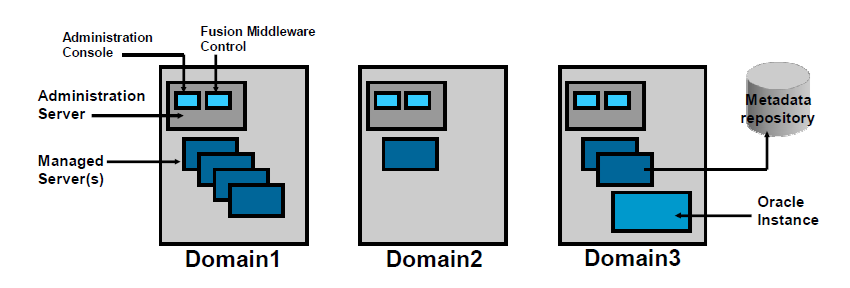

# Oracle WebLogic Server

Oracle WebLogic Server is a scalable, enterprise-ready Java Platform, Enterprise Edition (Java EE) application server. 

The WebLogic Server infrastructure supports the deployment of many types of distributed applications and it is an ideal foundation for building applications based on Service-Oriented Architecture (SOA).

WebLogic Server can define multiple environments called **domains**. 

Each domain consists of:
- one **Administration Server** 
- one (or more) **Managed Servers** 

Depending on the components that are installed, you may also have an Oracle Instance, and possibly a metadata repository if the installed components require one.

