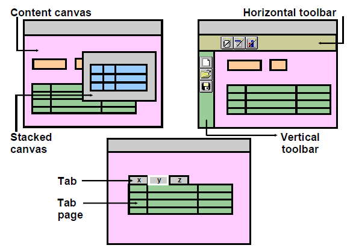

# Windows and Canvases

With Forms Builder, you can display an application in multiple windows by using its display objects: **windows** and **canvases**.

A **window** is a container for all visual objects that make up a Forms application. It is similar to an empty picture frame. The window manager provides the controls for the window that enable such functionality as scrolling, moving, and resizing. You can minimize a window. A single
form may include several windows.

A **canvas** is a surface inside a window container on which you place visual objects, such as interface items and graphics. It is similar to the canvas on which a picture is painted. To see a canvas and its contents at run time, you must display it in a window. A canvas always displays in the window to which it is assigned.

A **viewport** is an attribute of a canvas. It is effectively the visible portion of, or view onto, the canvas. When you resize a viewport, the window in which the canvas is displayed is resized.

There is an additional window, the **MDI (Multiple Document Interface)** window, that at run time displays the menu and toolbar, if any. It also displays the message and status areas, in addition to any document windows that may be open.

## Content Canvas

Forms Builder offers different types of canvases. A content canvas is the base canvas that **occupies the entire content pane of the window in which it is displayed**. The content canvas is the default canvas type. 

Each item in a form must refer to no more than one canvas. An item displays on the canvas to which it is assigned, through its Canvas property. If the Canvas property for an item is left unspecified, that item is said to be a *Null-canvas item* and will not display at run time.

You must create at least one content canvas for each window in your application. When you run a form, **only one content canvas can be displayed in a window at a time**, even though more than one content canvas can be assigned to the same window at design time.

At run time, a content canvas always completely fills its window. As the user resizes the window, Forms resizes the canvas automatically. If the window is too small to show all items on the canvas, Forms automatically scrolls the canvas to bring the current item into view.

**Note.** When you create a new form module, Forms Builder creates a new window implicitly. Thus, each new form module has one predefined window, which is called ```WINDOW1```.

## Displaying a Forms Module in Multiple Windows

Creating additional windows provides the ability to do the following:
- display two or more content canvases at once
- switch between canvases without replacing the initial one
- modularize the form contents into multiple layouts
- take advantage of window manager functionality (e.g. resize or close a window)

You can create two types of windows:
- **modeless window**
    - it is the default window type
    - it is an unrestricted window that the user can exit freely
    - it can be displayed at the same time as multiple other modeless windows
    - it not necessarily active when displayed
- **modal window** 
    - it is a restricted window that the user must respond to before moving the input focus to another window
    - it must be dismissed before control can be returned to a modeless window

## Canvas Types

In addition to the content canvas, Forms Builder provides three other types of canvases:
- **stacked canvas**
- **toolbar canvas**
- **tab canvas**



### Stacked Canvas

A stacked canvas is displayed on top of, or stacked on, the content canvas that is assigned to a window. It shares a window with a content canvas and any number of other stacked canvases. Stacked canvases are usually smaller than the window in which they display.

If a data block contains more items than the window can display, Forms scrolls the window
to display items that were initially not visible. This can cause important items, such as
primary key values, to scroll out of view. By placing important items on a content canvas,
and then placing the items that can be scrolled out of sight on a stacked canvas, the stacked canvas becomes the scrolling region, rather than the window itself.

Typical Usage of a Stacked Canvas
- Scrolling views
- Creating an overlay effect within a single window
- Displaying headers with constant information
- Creating a cascading or a revealing effect within a single window
- Displaying additional information
- Displaying information conditionally
- Displaying context-sensitive help
- Hiding information