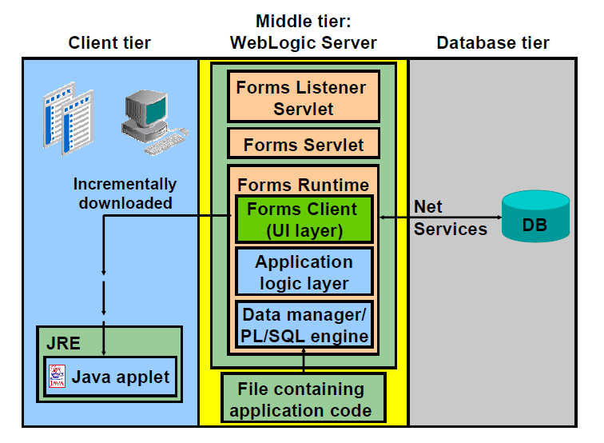

# Oracle Forms Services

Oracle Forms Services is a component of Oracle Fusion Middleware for delivering Oracle Forms applications to the Web. 

Oracle Forms Services automatically provides the infrastructure that is needed to successfully deliver applications on the Web through built-in services and optimizations.

Oracle Forms Services uses a **3-tier architecture** to deploy database applications:
- The client tier contains the web browser, where the application is displayed and used.
- The middle tier is the application server, where the application logic and server software reside
- The database tier is the database server, where enterprise data is stored

## Oracle Forms Services Architecture

Oracle Forms Services consists of 4 major components:
- the Java client (Forms Client)
- the Forms Listener Servlet
- the Forms Servlet
- the Forms Runtime Engine

When a user runs an Oracle Forms session over the Web, a thin, Java-based Forms applet is dynamically downloaded from the application server and automatically cached on the client computer. The same Java applet code can be used for any form, regardless of size and complexity.

